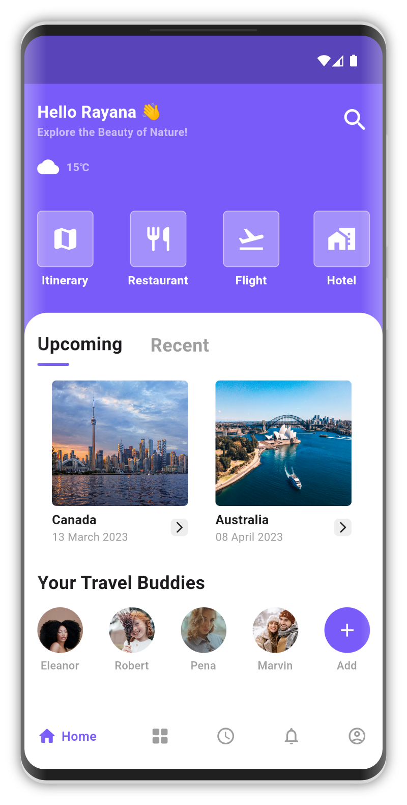
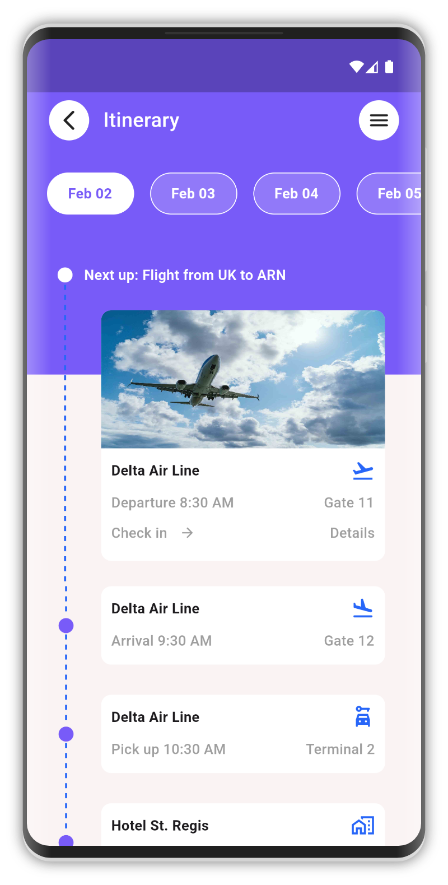

# Travel Agency APP UI

Travel Agency App UI developed using flutter.

## Details

This is a modern Travel agency app ui. With flutter I developed a pixel perfect UI.
In the UI there are two pages included. One is the homepage and other one is of the Itinerary option.

<!-- markdownlint-disable MD033 -->

  
  

<!-- markdownlint-disable MD033 -->

This UI is developed by me and designed by WeFrame Tech. The link of the design will be in the below.

[UI Design Link](https://dribbble.com/shots/21473914-Travel-service-Mobile-app "Visit Dribbble Website")
